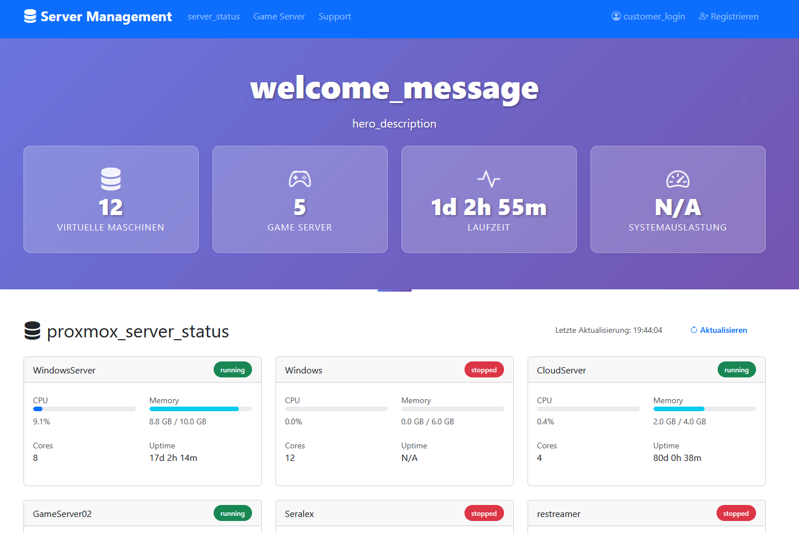
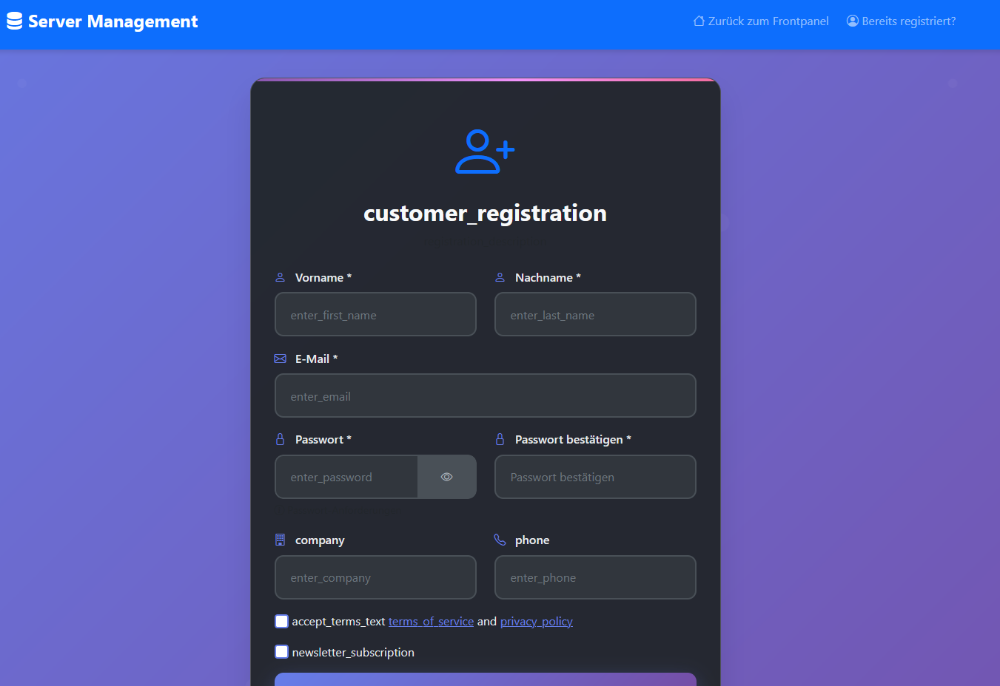
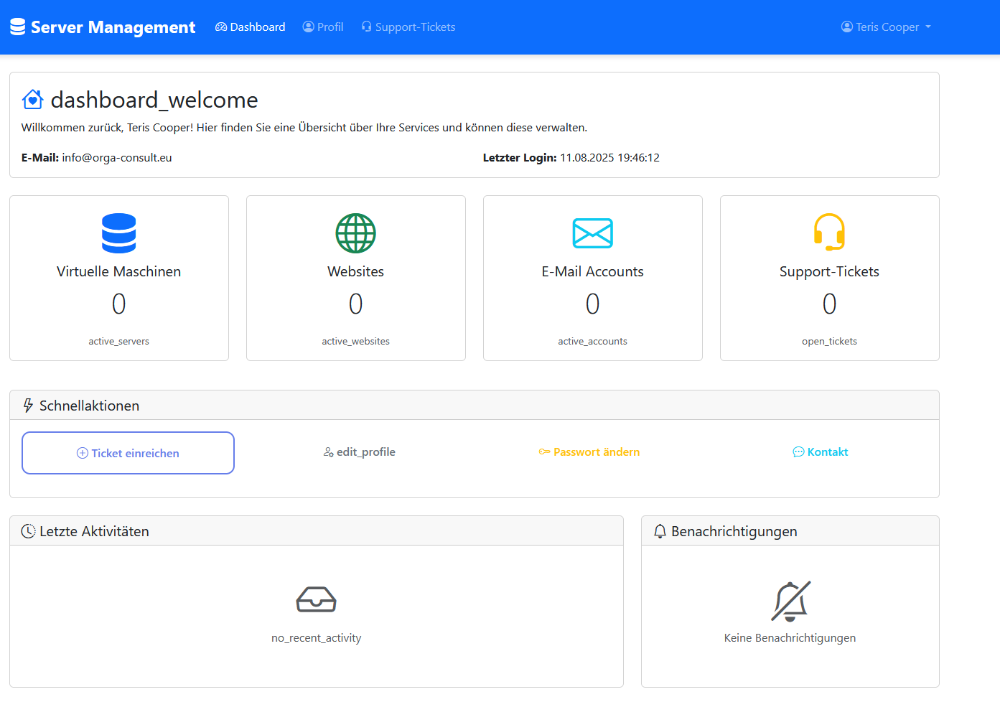
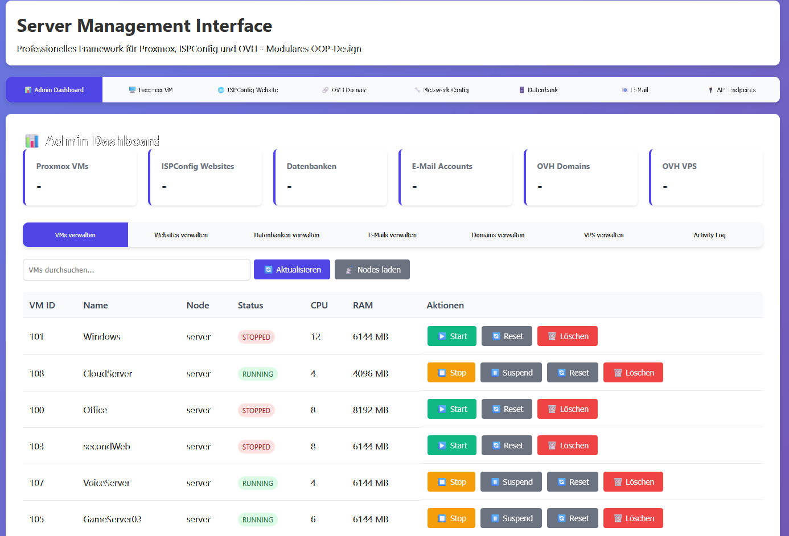
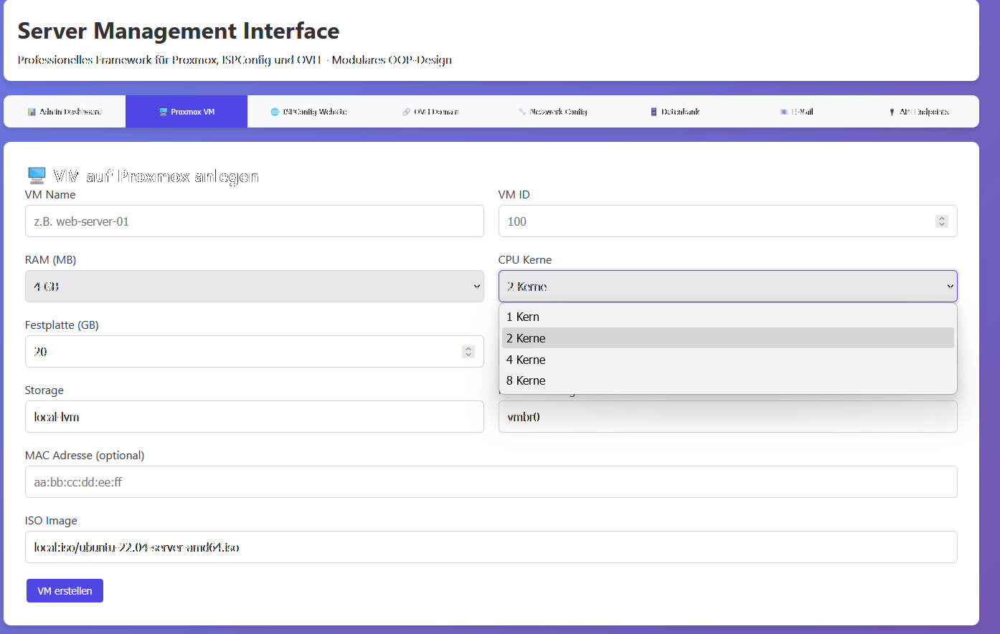
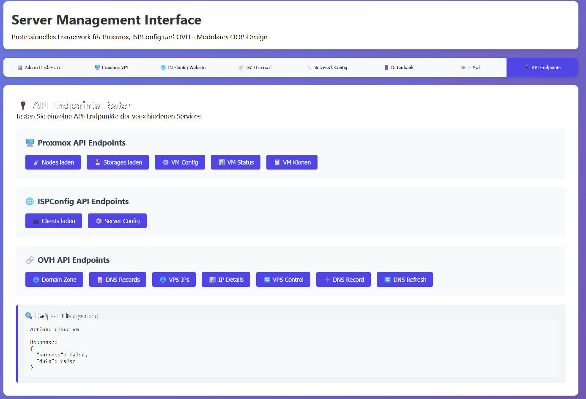

# 🚀 Server Management Framework

Ein professionelles PHP-Framework für die Verwaltung von Proxmox VMs, ISPConfig Websites und OVH Services.

[](https://php.net/)
[](LICENSE)
[]()

## 🎯 Zwei Verwendungsarten

Dieses Framework kann auf **zwei verschiedene Arten** verwendet werden:

### 1. 🚀 **Framework Only** (Empfohlen für Entwickler)
- **Nur die Kern-Funktionalität** ohne Web-Interface
- **Perfekt für API-Integrationen** und eigene Anwendungen
- **Minimale Abhängigkeiten** und schnelle Performance
- **Einfache Integration** in bestehende Projekte
- **📦 Standalone ZIP verfügbar** - Einfacher Download ohne Git-Kenntnisse
- **🔧 Sofort einsatzbereit** - Keine zusätzlichen Dateien oder Abhängigkeiten

### 2. 🌐 **Vollständiges CMS System** (Empfohlen für Endbenutzer)
- **Komplettes Web-Interface** mit Admin-Dashboard
- **Benutzerfreundliche Oberfläche** für alle Verwaltungsaufgaben
- **Vollständige Funktionalität** aller integrierten Services
- **Bereit für den produktiven Einsatz**

## 📋 Features

### 🔧 **Kern-Features (Beide Versionen)**
- **🖥️ Proxmox VE Integration** - Vollständige VM-Verwaltung (Erstellen, Starten, Stoppen, Klonen)
- **🌐 ISPConfig Integration** - Website, Datenbank und E-Mail Management
- **🔗 OVH API Integration** - Domain, VPS und Dedicated Server Verwaltung
- **🔗 OGP API Integration** - GameServer Verwaltung
- **📝 Activity Logging** - Vollständige Protokollierung aller Aktionen
- **🎯 OOP Design** - Saubere, modulare Architektur
- **🔌 Einzelne Endpunkte** - Jede API-Methode einzeln abrufbar

### 🌐 **CMS System Features (Nur Vollversion)**
- **📊 Admin Dashboard** - Moderne Web-Oberfläche mit Real-time Updates
- **🔐 Authentication Testing** - Umfassende API-Verbindungstests
- **🎨 Bootstrap 5.3.2** - Moderne, responsive Benutzeroberfläche
- **⚡ jQuery 3.7.1** - Optimierte JavaScript-Funktionalität

## 🖼️ Screenshots

### CMS System Interface




### Admin Panel




## 📦 Downloads & Releases

### **Neueste Version herunterladen**

Die neueste Version können Sie von den [GitHub Releases](https://github.com/teris/Server-Management-Framework/releases) herunterladen:

- **📁 Source Code (ZIP)** - Vollständiges Repository mit CMS System
- **🚀 framework-standalone.zip** - Framework Only Version (Empfohlen für Entwickler)

### **Release-Informationen**

Basierend auf den [aktuellen Releases](https://github.com/teris/Server-Management-Framework/releases) ist die neueste Version **v3.1.0** mit folgenden Verbesserungen:

- ✅ **Multi-Datenbank-Support** - Separate SQL-Dateien für MySQL, PostgreSQL, SQLite und MongoDB
- ✅ **Performance-Optimierung** - Optimierte Indizes und Views für bessere Abfrage-Performance
- ✅ **Datenintegrität** - Vollständige Foreign Key Constraints und Referential Integrity
- ✅ **Bereinigte Struktur** - Entfernung von 10 nicht verwendeten Tabellen für schlankere Datenbank
- ✅ **Standarddaten** - Grunddaten für sofortige Nutzung nach Installation
- ✅ **Umfassende Dokumentation** - Migrationsleitfaden und detaillierte Anweisungen

## 🔄 Manual Updater

Der Manual Updater ermöglicht es, das Framework direkt aus dem Admin-Panel zu aktualisieren. Er prüft GitHub-Releases, bietet die Wahl zwischen „Framework Only“ und „Vollständigem Update“ und kann optional vorab ein Backup erstellen.

### Features
- 🔍 Automatische Versionsprüfung über GitHub API (Latest/Tag)
- 🌓 Stable/Nightly-Erkennung durch Vergleich mit `CHANGELOG.md`
- 🎯 Update-Typen: Framework Only oder Vollständiges Update (asset-basiert)
- 🛡️ Optionale Backups (Dateien und – optional – Datenbank) vor der Installation
- 🌐 Mehrsprachigkeit (DE/EN) via Framework-`t()` Integration
- 🧪 Debug-/Tests: ZIP-Test, schrittweiser Backup-Test, Debug-Infos

### Verwendung (Admin-Panel)
- Navigation → Optionen → Manual Updater
- Ablauf:
  1) Systeminformationen prüfen, 2) Updates suchen, 3) Update-Typ wählen,
  4) optional Backup erstellen, 5) Update installieren (Fortschritt & Log sichtbar)

### Technische Details
- GitHub REST API v3: `releases/latest`, `releases/tags/{tag}`
- Asset-Auswahl: `framework-standalone.zip` für Framework Only; sonst Haupt-Release-Asset
- Sicherheit: HTTPS-Downloads, ZIP-Validierung/Extraktion, Schutz von `sys.conf.php` (bei Vollupdate), Aufräumen temporärer Dateien

### System-Anforderungen
- PHP-Extension `zip`
- Netzwerkzugriff für GitHub API (`file_get_contents` oder `curl`)
- Schreibrechte auf Framework- und temporäre Verzeichnisse

### Sicherheit & Best Practices
- Nightly-Versionen nur in Testumgebungen einsetzen
- Vor wichtigen Updates stets ein Backup erstellen
- Wartungsfenster nutzen und Logs nach Updates prüfen

## 🚀 Quick Start

### **Option 1: Framework Only (Empfohlen für Entwickler)**

#### **Download der Standalone Version (Empfohlen)**
```bash
# Laden Sie die neueste framework-standalone.zip von den Releases herunter
# https://github.com/teris/Server-Management-Framework/releases

# Entpacken Sie die ZIP-Datei
unzip framework-standalone.zip
cd framework-standalone

# Konfiguration anpassen
nano config/config.inc.php

# Datenbank einrichten (wählen Sie eine Option)
mysql -u root -p < config/framework-mysql.sql
# ODER
psql -U postgres -d server_management -f config/framework-postgresql.sql
# ODER
sqlite3 server_management.db < config/framework-sqlite.sql
# ODER
mongosh server_management < config/framework-mongodb.js

# Framework in Ihrem Code verwenden
php -r "require_once 'framework.php'; echo 'Framework geladen!';"
```

#### **Oder Repository klonen**
```bash
# Repository klonen
git clone https://github.com/teris/server-management-framework.git
cd server-management-framework

# Konfiguration anpassen
nano config/config.inc.php

# Datenbank einrichten (wählen Sie eine Option)
mysql -u root -p < config/framework-mysql.sql
# ODER
psql -U postgres -d server_management -f config/framework-postgresql.sql
# ODER
sqlite3 server_management.db < config/framework-sqlite.sql
# ODER
mongosh server_management < config/framework-mongodb.js

# Framework in Ihrem Code verwenden
php -r "require_once 'framework.php'; echo 'Framework geladen!';"
```

### **Option 2: Vollständiges CMS System**

```bash
# Repository klonen
git clone https://github.com/teris/server-management-framework.git
cd server-management-framework

# Installation starten
php src/install.php

# Oder manuelle Installation
nano config/config.inc.php
mysql -u root -p < install/database-structure-optimized.sql

# Webserver starten
php -S localhost:8000
```

## ⚙️ Detaillierte Installation

### **Framework Only Installation**

#### **Methode 1: Standalone Version (Empfohlen)**

1. **Download der neuesten Version:**
   ```bash
   # Besuchen Sie: https://github.com/teris/Server-Management-Framework/releases
   # Laden Sie die neueste framework-standalone.zip herunter
   ```

2. **Entpacken und konfigurieren:**
   ```bash
   unzip framework-standalone.zip
   cd framework-standalone
   nano config/config.inc.php
   # Editieren Sie die Konfiguration mit Ihren API-Credentials
   ```

3. **Datenbank einrichten (wählen Sie eine Option):**

#### **Methode 2: Repository klonen**

1. **Repository klonen:**
   ```bash
   git clone https://github.com/teris/server-management-framework.git
   cd server-management-framework
   ```

2. **Konfiguration anpassen:**
   ```bash
   nano config/config.inc.php
   # Editieren Sie die Konfiguration mit Ihren API-Credentials
   ```

3. **Datenbank einrichten (wählen Sie eine Option):**

**MySQL/MariaDB:**
```bash
mysql -u root -p < config/framework-mysql.sql
```

**PostgreSQL:**
```bash
psql -U postgres -d server_management -f config/framework-postgresql.sql
```

**SQLite:**
```bash
sqlite3 server_management.db < config/framework-sqlite.sql
```

**MongoDB:**
```bash
# MongoDB-Shell starten
mongosh server_management < config/framework-mongodb.js

# Oder interaktiv
mongosh
use server_management
load("config/framework-mongodb.js")
```

### **Vollständiges CMS System Installation**

#### 1. Repository klonen
```bash
git clone https://github.com/teris/server-management-framework.git
cd server-management-framework
```

#### 2. Automatische Installation (Empfohlen)
```bash
php src/install.php
```
Der Installer führt Sie durch alle Schritte und richtet automatisch alles ein.

#### 3. Manuelle Installation

**Composer Dependencies (optional):**
```bash
composer install
```

**Konfiguration:**
```bash
nano config/config.inc.php
# Editieren Sie die Konfiguration mit Ihren API-Credentials
```

**Datenbank einrichten:**
```bash
# MySQL/MariaDB
mysql -u root -p < install/database-structure-optimized.sql

# PostgreSQL
psql -U postgres -d server_management -f install/database-structure-postgresql.sql

# SQLite
sqlite3 server_management.db < install/database-structure-sqlite.sql

# MongoDB
mongosh server_management < install/mongodb/database-structure-mongodb.js
```

**Webserver konfigurieren:**
- **Apache:** DocumentRoot auf das Projektverzeichnis setzen
- **Nginx:** Root auf das Projektverzeichnis setzen
- **PHP Dev Server:** `php -S localhost:8000`

**Permissions setzen:**
```bash
chmod 755 ./
chmod 644 config/config.inc.php
```

## 🔧 Konfiguration

### **Datenbank-Konfiguration**

Die Datenbankverbindung wird in `/config/config.inc.php` konfiguriert:

```php
const DB_TYPE = 'mysql';  // mysql, pgsql, sqlite, mongodb, mariadb
```

### **API-Credentials**

Tragen Sie Ihre API-Credentials in `config/config.inc.php` ein:

#### **OVH Consumer Key erstellen**

1. Besuchen Sie: https://eu.api.ovh.com/createToken/
2. Setzen Sie diese Rechte:
   ```
   GET /*
   POST /*
   PUT /*
   DELETE /*
   ```
3. Kopieren Sie den Consumer Key in Ihre Konfiguration

## 🎯 Verwendung

### **Framework Only Verwendung**

#### ServiceManager API

```php
<?php
require_once 'framework.php';

$serviceManager = new ServiceManager();

// Proxmox VM erstellen
$vmData = [
    'vmid' => '101',
    'name' => 'test-server',
    'node' => 'pve',
    'memory' => '4096',
    'cores' => '2',
    'disk' => '20',
    'storage' => 'local-lvm',
    'bridge' => 'vmbr0',
    'iso' => 'local:iso/ubuntu-22.04.iso'
];
$result = $serviceManager->createProxmoxVM($vmData);

// VM steuern
$serviceManager->controlProxmoxVM('pve', '100', 'start');
$serviceManager->controlProxmoxVM('pve', '100', 'stop');

// ISPConfig Website erstellen
$websiteData = [
    'domain' => 'example.com',
    'ip' => '192.168.1.100',
    'user' => 'web1',
    'group' => 'client1',
    'quota' => 1000,
    'traffic' => 10000
];
$result = $serviceManager->createISPConfigWebsite($websiteData);

// OVH Domain bestellen
$result = $serviceManager->orderOVHDomain('example.com', 1);
?>
```

#### Direkte API-Klassen

```php
// ProxmoxGet für erweiterte Abfragen
$proxmoxGet = new ProxmoxGet();
$vms = $proxmoxGet->getVMs('pve');
$vmStatus = $proxmoxGet->getVMStatus('pve', '100');

// ISPConfigGet für erweiterte Abfragen
$ispconfigGet = new ISPConfigGet();
$websites = $ispconfigGet->getWebsites(['domain' => 'example.com']);
$databases = $ispconfigGet->getDatabases();

// OVHGet für erweiterte Abfragen
$ovhGet = new OVHGet();
$domains = $ovhGet->getDomains();
$vpsList = $ovhGet->getVPS();
```

### **CMS System Verwendung**

#### Web Interface

1. Öffnen Sie das Web-Interface in Ihrem Browser
2. Navigieren Sie zwischen den Tabs:
   - **📊 Admin Dashboard** - Übersicht aller Ressourcen
   - **🖥️ Proxmox VM** - VM-Verwaltung
   - **🌐 ISPConfig** - Website-Management
   - **🔗 OVH** - Domain & VPS Verwaltung
   - **🔐 Auth Status** - API-Verbindungstests

## 🏗️ Architektur

### **Framework Only Architektur**
```
Server-Management-Framework/
├── config/                 # Konfigurationsdateien
├── core/                   # Kern-Klassen (DatabaseManager.php)
└── framework.php          # Haupt-Framework-Datei
```

### **Vollständiges CMS System Architektur**
```
Server-Management-Framework/
├── assets/                 # CSS, JS und andere Assets
├── config/                 # Konfigurationsdateien
├── core/                   # Kern-Klassen (AdminCore, AdminHandler)
├── debug/                  # Debug-Tools und Utilities
├── module/                 # Modulare Komponenten
│   ├── admin/             # Admin-Dashboard
│   ├── proxmox/           # Proxmox-Integration
│   ├── ispconfig/         # ISPConfig-Integration
│   ├── ovh/               # OVH-Integration
│   └── ...                # Weitere Module
├── framework.php          # Haupt-Framework-Datei
├── index.php              # Web-Interface
└── auth_handler.php       # API-Authentifizierung
```

## 🧪 Tests

### **API-Verbindung testen**

```bash
# Alle APIs testen
php auth_handler.php

# Einzelne APIs testen
php auth_handler.php proxmox
php auth_handler.php ispconfig
php auth_handler.php ovh
```

### **Debug-Modus**

```bash
# Debug-Interface öffnen
php debug.php
```

## 🎨 UI Framework (Nur CMS System)

Das CMS System verwendet **Bootstrap 5.3.2** und **jQuery 3.7.1** für eine moderne, responsive Benutzeroberfläche:

### **Bootstrap Features**
- Responsive Grid-System
- Bootstrap Tabs und Pills
- Toast-Benachrichtigungen
- Bootstrap Icons
- Moderne Card-Layouts

### **JavaScript Features**
- jQuery AJAX-Handler
- Bootstrap Toast-Integration
- Modulare JavaScript-Struktur
- Real-time Updates

## Standard-Zugangsdaten

**⚠️ WICHTIG: Diese Zugangsdaten sind nur für Tests gedacht und sollten nach der Installation sofort geändert werden!**

### **Admin-Benutzer**
- **Benutzername:** `admin`
- **E-Mail:** Je nach Datenbank unterschiedlich:
  - MySQL/MariaDB: `admin@your-server.com`
  - PostgreSQL: `admin@yourserver.com`
  - SQLite: `admin@orga-consult.eu`
- **Passwort:** `password`
- **Rolle:** `admin`
- **Status:** `active`

### **Passwort-Hash**
Das Standardpasswort ist mit PHP's `password_hash()` gehasht:
```
$2y$10$92IXUNpkjO0rOQ5byMi.Ye4oKoEa3Ro9llC/.og/at2.uheWG/igi
```

### **Sicherheitshinweis**
Das Standardpasswort `password` ist **nicht sicher** und sollte **unbedingt sofort nach der Installation geändert werden**! Es handelt sich um ein bekanntes Standardpasswort, das nur für Tests und die erste Einrichtung gedacht ist.

## Migration von alter Struktur

### 1. Backup erstellen
```bash
mysqldump -u root -p server_management > backup_old_structure.sql
```

### 2. Daten exportieren (nur verwendete Tabellen)
```sql
-- Export der verwendeten Tabellen
SELECT * FROM users INTO OUTFILE 'users_backup.csv';
-- ... weitere Tabellen
```

### 3. Neue Struktur installieren
```bash
mysql -u root -p < database/database-structure-optimized.sql
```

### 4. Daten importieren
```sql
-- Import der gesicherten Daten
LOAD DATA INFILE 'users_backup.csv' INTO TABLE users;
-- ... weitere Tabellen
```

## Troubleshooting

### **Häufige Probleme**

1. **Foreign Key Fehler**
   - Prüfen Sie die Reihenfolge der Datenimporte
   - Stellen Sie sicher, dass referenzierte Daten existieren

2. **Performance-Probleme**
   - Prüfen Sie die Indizes
   - Verwenden Sie EXPLAIN für langsame Queries

3. **Encoding-Probleme**
   - Verwenden Sie UTF8MB4 für MySQL
   - Prüfen Sie die Datenbank-Collation

4. **MongoDB Extension Fehler**
   - Installieren Sie die MongoDB PHP Extension: `sudo apt-get install php-mongodb`
   - Aktivieren Sie die Extension in php.ini
   - Starten Sie den Webserver neu

## 🐛 Bug Reports & Support

Bitte verwenden Sie das [GitHub Issues System](https://github.com/teris/server-management-framework/issues) für:
- Bug Reports
- Feature Requests
- Support-Anfragen
- Verbesserungsvorschläge

**Bug Report Template:**
- **Beschreibung:** Was ist passiert?
- **Erwartetes Verhalten:** Was sollte passieren?
- **Schritte zur Reproduktion:** Wie kann der Fehler reproduziert werden?
- **Environment:** PHP Version, OS, etc.
- **Logs:** Relevante Error-Logs

## 🤝 Contributing

Beiträge sind willkommen! Bitte lesen Sie [CONTRIBUTING.md](CONTRIBUTING.md) für Details.

1. **Fork** das Repository
2. **Erstellen** Sie einen Feature-Branch (`git checkout -b feature/amazing-feature`)
3. **Commit** Ihre Änderungen (`git commit -m 'Add amazing feature'`)
4. **Push** zum Branch (`git push origin feature/amazing-feature`)
5. **Öffnen** Sie eine Pull Request

## 📚 Dokumentation

- **[GitHub Wiki](https://github.com/teris/Server-Management-Framework/wiki)** - Vollständige Dokumentation
- **[FrameWorkShema](FrameWorkShema/)** - HTML-Version der Dokumentation
- **[CONTRIBUTING.md](CONTRIBUTING.md)** - Richtlinien für Beiträge
- **[CHANGELOG.md](CHANGELOG.md)** - Versionshistorie
- **[SECURITY.md](SECURITY.md)** - Sicherheitsrichtlinien
- **[SUPPORT.md](SUPPORT.md)** - Support und Troubleshooting

## 📋 Roadmap & Release-Historie

### **Aktuelle Version: v3.1.0**
- ✅ **Multi-Datenbank-Support** - Separate SQL-Dateien für alle unterstützten Datenbanken
- ✅ **Performance-Optimierung** - Optimierte Indizes und Views für bessere Performance
- ✅ **Datenintegrität** - Vollständige Foreign Key Constraints und Referential Integrity
- ✅ **Bereinigte Struktur** - Entfernung nicht verwendeter Tabellen für schlankere Datenbank
- ✅ **Standarddaten** - Grunddaten für sofortige Nutzung nach Installation

### **Wichtige Meilensteine**
- [x] **v2.0** - REST API für externe Integration
- [x] **v2.1** - Backup & Restore Funktionen
- [X] **v2.2** - Monitoring & Alerting
- [X] **v2.3** - Multi-User Support mit Rollen
- [x] **v2.4** - CLI Tools (update.php)
- [X] **v2.5** - Plugin System
- [x] **v2.6** - Use Framework as Single without Interface
- [x] **v2.7** - Bootstrap 5.3.2 Migration
- [x] **V2.8** - Databasemodus
- [X] **V3.0** - Gameserver Verwaltung

### **Alle Releases ansehen**
Besuchen Sie die [GitHub Releases Seite](https://github.com/teris/Server-Management-Framework/releases) für eine vollständige Übersicht aller Versionen und Download-Links.

## 🔒 Sicherheit

- **API-Credentials** werden sicher gespeichert
- **HTTPS** wird für alle API-Aufrufe verwendet
- **Input Validation** für alle Benutzereingaben
- **SQL Injection** Schutz durch PDO Prepared Statements
- **Session Management** mit sicheren Cookies

**Sicherheitslücken melden:** Bitte erstellen Sie ein privates GitHub Issue.

## 📄 Lizenz

Dieses Projekt steht unter der MIT-Lizenz - siehe [LICENSE](LICENSE) für Details.

## 👥 Autoren

- **Teris** - *Initial work* - [GitHub](https://github.com/teris)

Siehe auch die Liste der [Contributors](https://github.com/teris/server-management-framework/contributors).

## 🙏 Danksagungen

- **Proxmox VE Team** - Für die ausgezeichnete Virtualisierungsplattform
- **ISPConfig Team** - Für das umfassende Hosting-Control-Panel
- **OVH** - Für die robuste API
- **PHP Community** - Für die großartigen Tools und Libraries
- **Bootstrap Team** - Für das moderne CSS-Framework

## 📊 Status


---

**Happy Server Managing! 🚀**
